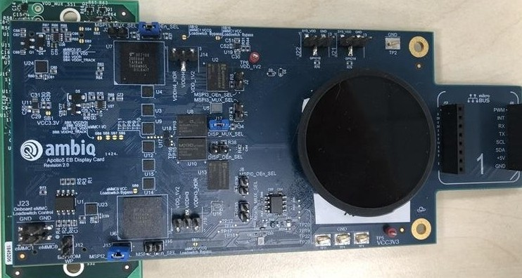
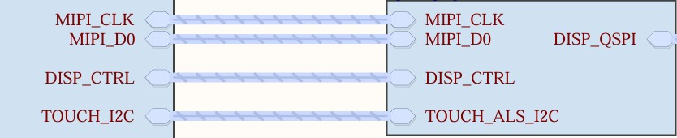

.. _apollo5_eb_display_card:

Ambiq Apollo510 Display Add-on Board
####################################

Overview
********

Display shield add-on board for AP510 1.4" round 454x454 AMOLED touchscreen with
MIPI-DSI/QSPI interfaces.

.. note::
   The shield apollo5_eb_display_card is utilizing a CO5300 panel controller and
   shall specifically use ``apollo5_eb_display_card`` as SHIELD

   Apollo510 EB Display Card Revision 2.0, which is designed for apollo510 series
   engineering boards.

   Apollo510 EB Display Card Revision 2.0 Connector. For the MIPI-DSI of the
   Apollo510L_eb board, the interposer (the green part under the blue shield board)
   is not required.

Display Connector J9
+------+--------------+------------+-------+--------------+-----------------+
| J5   | Description  | Interface  | J5    | Description  | Interface       |
| odd  |              |            | even  |              |                 |
+======+==============+============+=======+==============+=================+
| 1    | TOUCH_INT    | GPIO       | 2     | TOUCH_SDA    | I2C             |
+------+--------------+------------+-------+--------------+-----------------+
| 3    | TOUCH_SCL    | I2C        | 4     | VCC3V3       | Power           |
+------+--------------+------------+-------+--------------+-----------------+
| 5    | QSPI_D3      | QSPI       | 6     | VCC3V3       | Power           |
+------+--------------+------------+-------+--------------+-----------------+
| 7    | QSPI_D2      | QSPI       | 8     | GND          | -               |
+------+--------------+------------+-------+--------------+-----------------+
| 9    | DISP_RST     | GPIO       | 10    | -            | -               |
+------+--------------+------------+-------+--------------+-----------------+
| 11   | -            | -          | 12    | VDD_5V       | Power           |
+------+--------------+------------+-------+--------------+-----------------+
| 13   | QSPI_D0      | QSPI       | 14    | QSPI_CLK     | QSPI            |
+------+--------------+------------+-------+--------------+-----------------+
| 15   | GND          | -          | 16    | CSX          | QSPI            |
+------+--------------+------------+-------+--------------+-----------------+
| 17   | GND          | -          | 18    | MIPI_D0_N    | DSI             |
+------+--------------+------------+-------+--------------+-----------------+
| 19   | MIPI_D0_P    | DSI        | 20    | GND          | -               |
+------+--------------+------------+-------+--------------+-----------------+
| 21   | MIPI_CLK_N   | DSI        | 22    | MIPI_CLK_P   | DSI             |
+------+--------------+------------+-------+--------------+-----------------+
| 23   | GND          | -          | 24    | SYS_VDD      | Power           |
+------+--------------+------------+-------+--------------+-----------------+
| 25   | DISP_TE      | DSI/QSPI   | 26    | VCC3V3       | Power           |
+------+--------------+------------+-------+--------------+-----------------+
| 27   | QSPI_D1      | QSPI       | 28    | GND          | -               |
+------+--------------+------------+-------+--------------+-----------------+
| 29   | TOUCH_RST    | GPIO       | 30    | GND          | -               |
+------+--------------+------------+-------+--------------+-----------------+

Requirements
************

Your board needs to have a ``mipi_dsi`` or ``spi`` device tree label to work with
this shield.

Usage
*****

The shield can be used in any application by setting ``SHIELD`` to
``apollo5_eb_display_card`` and adding the necessary device tree properties.

Set ``--shield apollo5_eb_display_card`` when you invoke ``west build``. For example:

.. zephyr-app-commands::
   :zephyr-app: samples/drivers/display
   :board: apollo510L_eb
   :shield: apollo5_eb_display_card
   :goals: build

If the user wants to drive the display with QSPI interface,
set ``--shield apollo5_eb_display_card_spi`` when you invoke ``west build``. For example:

.. zephyr-app-commands::
   :zephyr-app: samples/drivers/display
   :board: apollo510L_eb
   :shield: apollo5_eb_display_card_spi
   :goals: build

References
**********

The Apollo510 Engineering Board & its components are not sold, you can contact us to
inquire about replacement boards.

- `Product page <https://support.ambiq.com/hc/en-us>`_
